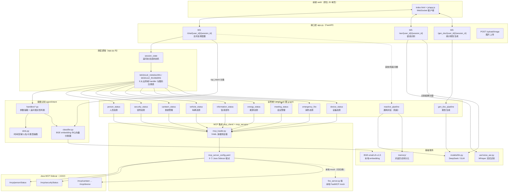
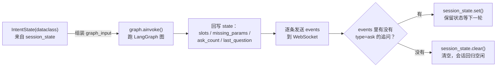
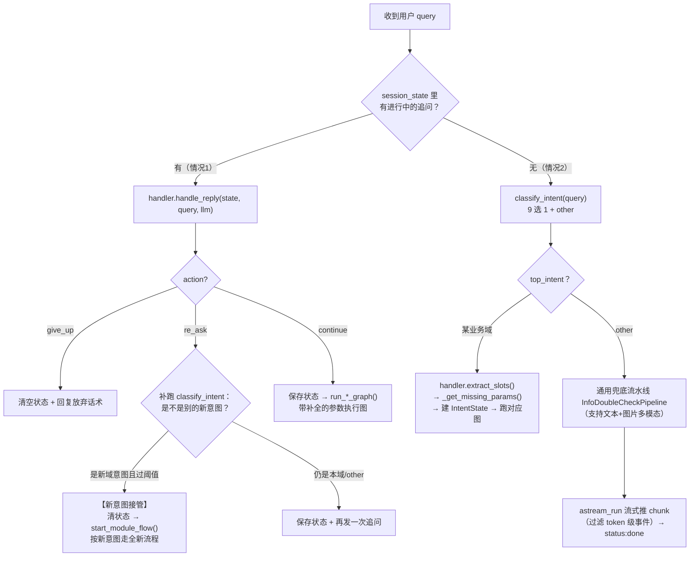
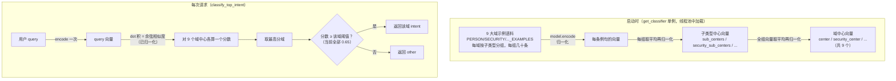
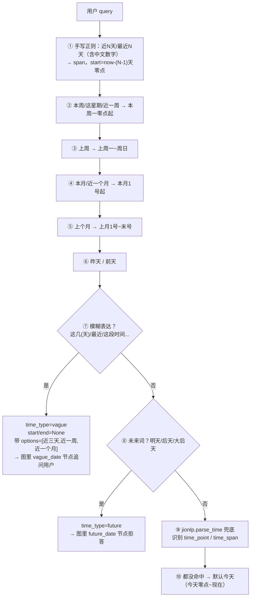
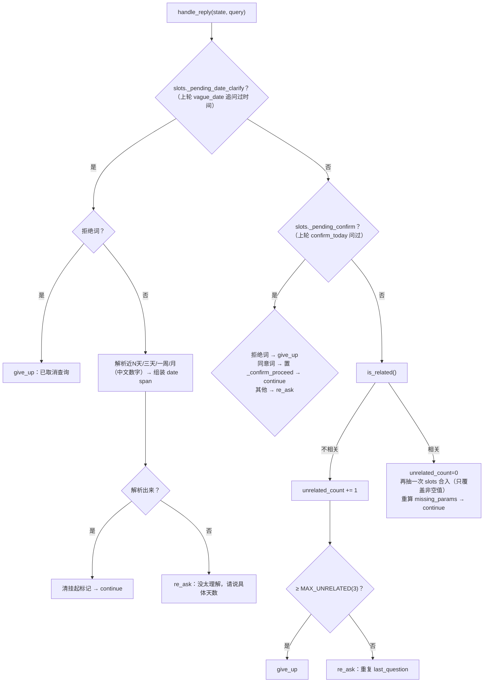
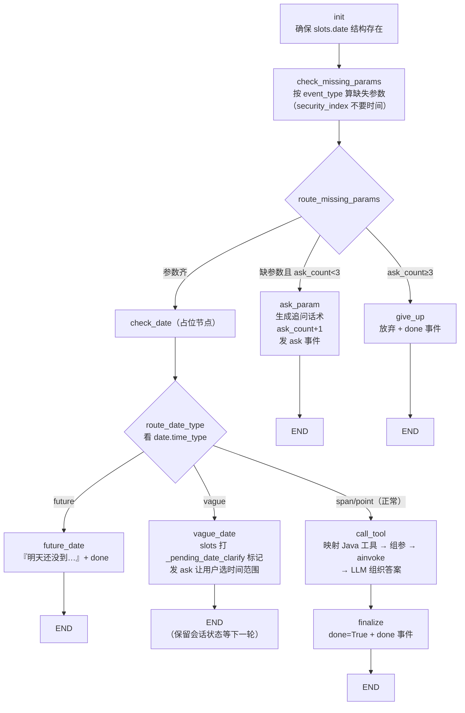
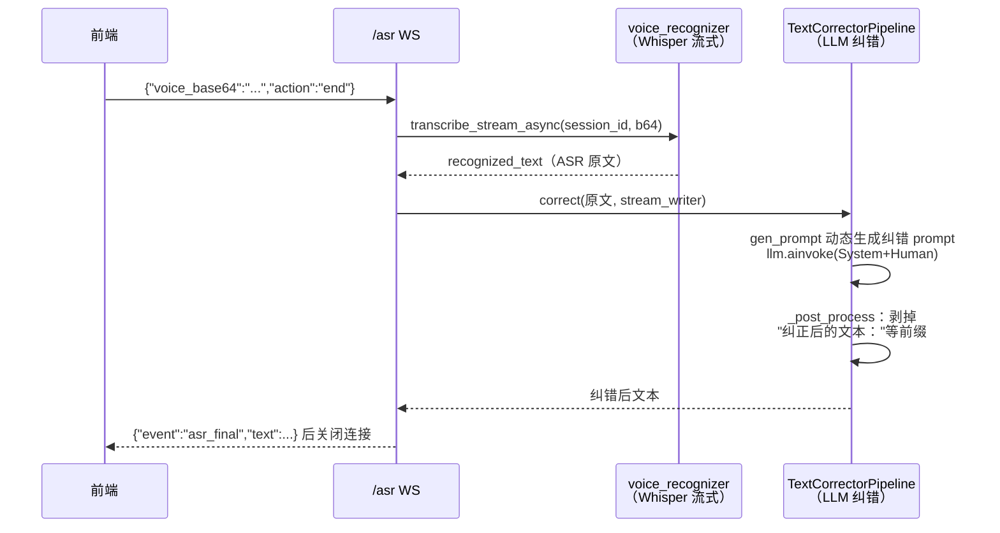

# 智慧园区 AI 智能体（ai-agentic-app）架构文档

> 本文对应代码库根目录下的当前版本（9 大业务域 + 通用对话 + 报告生成 + 语音链路）。
> 文中所有流程图使用 Mermaid 绘制，在 VSCode 中安装
> **Markdown Preview Mermaid Support** 插件后，`Ctrl+Shift+V` 打开预览即可看到渲染效果。

---

## 目录

1. [项目定位与技术栈](#1-项目定位与技术栈)
2. [总体架构图](#2-总体架构图)
3. [目录结构导览](#3-目录结构导览)
4. [入口层：app.py](#4-入口层apppy)
5. [意图识别层：agent/intent](#5-意图识别层agentintent)
6. [会话状态：memory/session_state.py](#6-会话状态memorysession_statepy)
7. [业务域执行层：graph/*_langgraph.py](#7-业务域执行层graph-_langgraphpy)
8. [MCP 集成层](#8-mcp-集成层)
9. [通用对话流水线：graph/reactive_pipeline.py](#9-通用对话流水线graphreactive_pipelinepy)
10. [报告生成流水线：graph/gen_doc_pipeline.py](#10-报告生成流水线graphgen_doc_pipelinepy)
11. [语音链路：/asr + asr_pipeline](#11-语音链路asr--asr_pipeline)
12. [记忆系统：memory/](#12-记忆系统memory)
13. [模型层：models/llm.py](#13-模型层modelsllmpy)
14. [前端：web/](#14-前端web)
15. [测试：tests/](#15-测试tests)
16. [附录 A：WebSocket 事件协议](#附录-awebsocket-事件协议)
17. [附录 B：九大业务域速查表](#附录-b九大业务域速查表)

---

## 1. 项目定位与技术栈

一句话定位：**一个面向智慧园区的多域问答智能体后端**。用户用自然语言提问（"现在园区有多少人"、"今天安防告警有哪些"、"本周菜谱是什么"），系统自动识别意图 → 抽取参数 → （缺参数时多轮追问）→ 通过 MCP 协议调用 Java 后端工具查询真实数据 → 用 LLM 组织成自然语言回答，流式推送到前端。

| 维度 | 选型 |
|---|---|
| Web 框架 | FastAPI（WebSocket 为主，HTTP 仅用于上传/静态文件） |
| Agent 编排 | LangGraph（StateGraph 状态机）+ LangChain（AgentExecutor / LLMChain） |
| 意图识别 | sentence-transformers + `BAAI/bge-small-zh-v1.5` 本地小模型（embedding 余弦相似度） |
| 参数抽取 | jionlp（中文时间解析）+ 正则 + 别名词典 |
| 工具协议 | MCP（`langchain-mcp-adapters`，streamable_http 连 Java Sidecar；stdio 连本地 mock） |
| 大模型 | OpenAI 兼容 API（DeepSeek / 智谱 GLM），可切换 Ollama 本地模型 |
| 语音 | Whisper（流式 ASR）+ LLM 文本纠错 |
| 持久化 | 内存会话状态 + JSON/SQLite/MySQL 对话历史（可配置） |
| 前端 | 原生 HTML/CSS/JS 单页（`web/`），WebSocket 直连 |
| 测试 | pytest（本机依赖不全时用 stub 验证，真实运行环境为 Linux 容器） |

---

## 2. 总体架构图



**关键设计思想**：

- **"小模型分类 + 规则抽取 + 大模型组织"三层分工**：意图判断用便宜的本地 embedding 模型（毫秒级、离线）；参数抽取用正则/词典（确定性、可调试）；只有最终"把 JSON 数据讲成人话"这一步才调用大模型。这样 90% 的请求不消耗 LLM token。
- **每个业务域一条独立的 LangGraph 状态机**，结构完全对称（同一个模板复制 9 份），由 `app.py` 的注册表统一调度。
- **多轮追问状态放在进程内存**（`session_state`），LangGraph 图本身每次调用都是一次性的；图跑完后把 `slots/ask_count` 等回写到会话状态，形成跨轮闭环。

---

## 3. 目录结构导览

```
ai-agentic-app/
├── app.py                     # FastAPI 入口：3 个 WebSocket + 调度逻辑（见 §4）
├── agent/
│   ├── intent/                # 意图识别（见 §5）
│   │   ├── classifier.py      #   BGE embedding 分类器 + 各域示例语料
│   │   ├── slots.py           #   时间/区域/人名/各域子类型抽取（纯正则）
│   │   ├── intent_seeds.py    #   从接口文档抽取的意图种子（权威定义）
│   │   ├── generate_intent_examples.py  # 用 DeepSeek 批量生成/扩写语料的脚本
│   │   └── handlers/          #   9 个域的 IntentHandler（追问判断等）
│   ├── executor.py            # AgentExecutorWrapper：带历史的 LangChain Agent
│   ├── reactive_pipeline 用到的各类 prompt（*_prompt.py）
│   └── rag_prompts.py
├── graph/                     # LangGraph 流水线（见 §7/9/10/11）
│   ├── *_langgraph.py         #   9 个业务域状态图 + 各自 load_*_tools()
│   ├── reactive_pipeline.py   #   通用对话（意图→追问→Agent→评估→合成）
│   ├── gen_doc_pipeline.py    #   统计报告分章节生成
│   └── asr_pipeline.py        #   ASR 文本纠错
├── mcp_client/
│   ├── mcp_loader.py          # YAML → 多 MCP server 并发加载（见 §8）
│   └── mcp_server_config.yaml # 9 个 Java Sidecar 端点 + 注释掉的本地 mock
├── mcp_servers/               # 本地 Python mock MCP 服务（FastMCP, stdio）
├── memory/
│   ├── session_state.py       # 追问态会话状态机（IntentState，见 §6）
│   ├── store.py               # MemoryStore：多用户对话记忆管理
│   └── memory_persistor*.py   # JSON / SQLite / MySQL 三种持久化实现
├── models/llm.py              # LLM 工厂（DeepSeek/GLM/Ollama）
├── tools/load_tools.py        # 通用 Agent 的工具装配（当前只挂系统工具）
├── tools/                     # system_tools / rag_tools / custom_tool
├── dynamic_tools/             # 按 JSON 配置动态生成工具的机制
├── doc_tools/                 # Word 报告生成（样式 JSON + 生成器）
├── asr/                       # voice_asr.py（Whisper）+ text_corrector.py
├── web/                       # 新版前端（index.html + css/ + js/）
├── static/                    # 旧版前端（保留）
├── tests/                     # pytest：意图分类/handler/graph/mcp_loader/性能
├── docs/                      # 开发计划 / 问题排查 / 接口文档 / 本架构文档
└── global_config.json         # redis / dify / memory_persistor 配置
```

---

## 4. 入口层：app.py

### 4.1 应用初始化

- **日志**：`logging.basicConfig(filename='app.log', level=DEBUG)` 全部落文件。
- **中间件**：CORS 全放开（`allow_origins=["*"]`），方便本地前端调试。
- **静态目录**：
  - `/reports` → `./reports`：生成的 Word 报告下载目录；
  - `/static` → 旧版前端；`/uploads` → `/root/agentic-app/uploads`（**Linux 容器路径**，图片上传目录，注意在 Windows 本机跑会创建在根路径下）。
- **全局单例**（模块级创建，进程内共享）：
  - `llm = CustomLLMFactory().llms['silicon']` —— 当前实际指向 DeepSeek API（见 §13）；
  - `voice_recognizer`（Whisper 流式识别器）、`text_corrector`，初始化失败时置 `None` 并降级。
- **startup 事件**：`await get_classifier()` 预加载意图识别模型，避免第一个请求承担数秒的模型加载时间。

### 4.2 九个域的"执行助手"：完全对称的样板代码

`app.py` 为每个业务域写了三个构件（以人员态势为例，其余 8 个域逐字相同，只换名字）：

```python
_person_status_graph = None                 # 模块级缓存

async def get_person_status_graph():        # 懒加载：首次从 MCP 拉工具并编译图
async def run_person_status_graph(ws, state, user_id, session_id):  # 执行图
```

`run_*_graph` 的固定四步（这是**前后端多轮交互的核心闭环**）：



要点：

1. **IntentState(dataclass) → GraphState(TypedDict) 的转换**就在 `graph_input` 组装处：字段一一对应，`answer/error/events` 清空重填。
2. 必须用 `ainvoke`，因为 `call_tool` 节点内部 `await tool.ainvoke(...)` 是异步的。
3. 判断"是否追问"的方式是扫描 `events` 里有没有 `{"event":"custom","data":{"type":"ask"}}`——图的输出事件同时承担了"给前端的消息"和"给调度器的信号"两个职责。

### 4.3 调度注册表与新意图接管

```python
MODULE_HANDLERS = { "person_status": PersonStatusHandler, ... }   # 9 个 handler 类
MODULE_RUNNERS  = { "person_status": run_person_status_graph, ... } # 9 个图执行器

async def start_module_flow(websocket, query, module, user_id, session_id):
    """抽初始 slots → 建 IntentState → 落 session_state → 跑对应图"""
```

`start_module_flow` 把"情况 2"那套新建流程收拢成一个函数，供**追问态新意图接管**复用（见下文 1.2）。

### 4.4 主对话入口 `WS /chat/{user_id}/{session_id}`

连接建立时：生成 session_id → `load_tools()` → 创建 `InfoDoubleCheckPipeline`（通用兜底流水线，`use_evaluator=False`）。之后进入 `while True` 消息循环，**每条用户消息按下面这棵决策树分流**：



逐段解释：

- **预计算 top_intent**：如果已有进行中的追问任务，跳过意图分类（省一次模型调用，且避免追问回答"近三天"被误分类）；否则 `classify_intent(query)` 算一次。
- **情况 1（追问态）**：按 `active_state.module` 选 handler，调 `handle_reply`。返回三种 action：
  - `give_up`：用户拒绝/连续 3 次不相关 → 清状态、告知放弃；
  - `re_ask`：先补跑一次 `classify_intent` 做**新意图接管**——因为 `is_related` 是关键词启发式，用户直接说新需求（"帮我看看车位"）会被误判"不相关"，这里兜底：识别出其他域意图且过阈值 → 放弃当前任务，`start_module_flow` 走新流程；否则重复追问；
  - `continue`：把用户回复里抽到的参数合入 slots → 跑图。
- **情况 2（新意图）**：九个 `elif top_intent == "xxx"` 分支，逻辑完全一致：抽 slots → 算缺失参数 → 建 `IntentState` → `session_state.set()` → `run_*_graph()`。
- **兜底**：不属于任何业务域的问题，走 `InfoDoubleCheckPipeline.astream_run(content)`。`content` 是多模态数组（文本 + 可选 `image_url`），流式返回 LangChain 生命周期事件，但**过滤掉 `event == 'token'`** 的事件（该流水线的 token 流已由 custom 事件承载）。

### 4.5 其他入口

- **`WS /asr/{user_id}/{session_id}`**：语音识别，见 §11。
- **`WS /gen_doc/{user_id}/{session_id}`**：报告生成，见 §10。
- **`POST /upload/image`**：接收图片，用 uuid 重命名存到 uploads，返回 `{image_url}`（拼上 `BASE_URL = http://127.0.0.1:8001`）供多模态对话引用。
- `_safe_serialize`：递归把 LangChain `BaseMessage` 转 dict 的工具函数，保证所有 chunk 能 JSON 序列化后经 WebSocket 发送。
- `safe_send_message`：发送前检查 `client_state.CONNECTED`，断连静默失败，避免向已关闭的连接写数据抛异常。

---

## 5. 意图识别层：agent/intent

`agent/intent/__init__.py` 是统一出口，外部只 import：`classify_intent`、`classify_*_sub_type`（9 个域各一个）、`get_classifier`、9 个 Handler 类。

### 5.1 分类原理：embedding 中心向量法（classifier.py）

不用训练、不用 LLM，核心思路是**"用例句的平均向量代表一个类别的中心"**：



关键实现细节：

- **单例 + 线程池**：`SentenceTransformer` 的加载和 encode 都是同步阻塞操作，直接放 async 函数里会卡死 Uvicorn 事件循环。所以 `get_classifier()` 用 `loop.run_in_executor(None, PersonStatusClassifier)` 初始化，所有 `classify_*` 对外包装函数也都用 `run_in_executor` 包同步方法。
- **模型路径**：环境变量 `INTENT_MODEL_PATH`（容器里挂本地模型目录），缺省从 HuggingFace 拉 `BAAI/bge-small-zh-v1.5`。
- **两层分类**：
  - `classify_top_intent(query)`：**顶层意图**，9 个域中心 + `other`，一次编码打 9 个分。
  - `classify_*_sub_type(query)`：**域内子类型**，与该域的各子类型中心逐一算分取最高（没有阈值，永远返回最像的那个），供 handler 在正则失守时兜底（如人员态势 `classify_sub_type`）。
- **语料维护**：`intent_seeds.py` 是从《项目结构与接口文档.md》抽取的意图种子（每个域一个字典：`_desc` 总述 + 子类型描述）；`generate_intent_examples.py` 是离线脚本，调 DeepSeek API 按"疑问句/祈使句/口语化/场景化"四种风格为每个子类型批量生成约 25 条例句，**直接回写 classifier.py 的 `*_EXAMPLES` 字典**（自动备份 .bak）。也就是说语料是"AI 生成 + 人工校对"沉淀在代码里的。
- **为什么例句质量决定一切**：中心向量 = 例句向量的平均。例句越贴近真实用户说法，中心越准。安防语料少的时候注释建议先调低阈值。

### 5.2 参数抽取：slots.py（纯正则 + 词典，不调模型）

#### 通用原子抽取器

| 函数 | 逻辑 |
|---|---|
| `parse_time_slot(query)` | 见下方优先级链 |
| `parse_area_slot(query)` | 遍历 `AREA_DICT`（园区/A栋/B栋/主楼/食堂/停车场/大门口，每个标准名带若干别名），别名命中即返回标准名；未命中返回 `""` |
| `extract_person_name(query)` | 在 `EMPLOYEE_NAMES` 硬编码名单（张三…吴十）里做子串匹配。**故意不用正则**：中文人名结构复杂，正则会把"一下人员"这类词错当人名 |
| `parse_ordinal_choice(query, max_index)` | 解析"第一个/第 2 个/就第三个吧/纯数字 1"，供追问轮"选选项"，1-based，越界返回 None |
| `_parse_chinese_number` | 中文数字（一~九十九，含"两"）转 int，兼容阿拉伯数字 |

`parse_time_slot` 的**优先级链**（顺序很重要，先命中先返回）：



模块 import 时执行 `_warmup_jionlp()` 预热 jionlp 词典，避免首次请求慢。

#### 各域的 `extract_*_slots`

每个域一个函数，返回结构基本是 `{"query_type"/"event_type": 子类型, "date": {...}, ...域特有字段}`。**子类型判定是一串 if/elif 正则，书写顺序 = 优先级 = 从特异到宽泛**，注释里明确写了排序原因，例如人员态势：

1. `trace`（轨迹/行踪/动向）最具体，最先判；
2. `location`（在哪/位置）；
3. `abnormal`（异常/可疑/黑名单/陌生人）；
4. `flow`（流动/趋势）——**必须排在 enter/leave 之前**，否则"进入人员趋势"会被误判成"进入人数"；
5. `enter`（进入/进来/入园 + 多少/几个）；
6. `leave`（离开/出去/走了 + 多少/几个）；
7. `structure`（结构/占比/各单位名）——**排在 enter/leave 之后**，避免"省公司进了多少人"被误判成结构；
8. `realtime`（实时/现在多少人/在岗）；
9. 兜底 `count`（默认值）。

其他域的子类型（同样模式）：

- 安防 `extract_security_status_slots`：`security_index`（不需时间，优先）→ `ai_alert` → `inspection_trend` → `ai_inspection` → `alarm_detail`（需 alarm_id）→ `patrol` → `device`，兜底 `alarm_list`；额外抽 `alarm_id`（"第3条/告警ID 123/id:456"）。
- 车辆：`parking_space`（含"停车场监控"类问题兜底）→ `traffic_flow`（含"通行记录"）→ `parking_structure` → `official_vehicle` → `parking_duration_rank`，兜底 `count`。注释说明：Java 后端没有单独的"停车场监控/通行记录"工具，所以这两类说法合并进最近似的工具。
- 食堂：`dining_count`（人数，最优先）→ `dish_rank`（热度/排行）→ 兜底 `week_menu`（菜谱）；额外 `meal` 餐次（`MEAL_DICT` 别名词典：早餐/午餐/晚餐/夜宵）。
- 信息发布：`broadcast_equip` → `info_equip` → `task_trend` → `program_count` → `broadcast_view`，兜底 `info_view`。
- 能源：`metering_equipment` → `device_status` → `realtime_electricity` → `realtime_water` → `electricity_rank` → `water_rank` → `overall_energy`，兜底 `count`。
- 设备：`mj_online`（门禁，**优先于安防**，防"门禁"被泛化命中）→ `gb_online`（广播）→ `anfang_online`（安防/摄像头）→ `month_repair`（报修）→ `month_maintenance`（维修/维保）→ `category_health` → `statis_region` → `equip_class`，兜底 `count`。
- 消防：`month_repair`（报修/维修，**优先级最高**，避免被"告警"误抢）→ `fire_alarm_list`（实时告警）→ `fire_alarm_num`（告警统计）→ `fire_assets`（设备台账），兜底 `count`。
- 会议：`room_meet_list_by_day`（当日安排）→ `high_freq_meeting_rooms` → `meeting_room_status` → `meeting_room_overview` → `number_of_meetings` → `meeting_statistics`，兜底 `count`。

### 5.3 Handler：追问阶段的"裁判"（handlers/）

`base.py` 定义抽象基类 `IntentHandler`，约定三个方法：`extract_slots(query)`、`is_related(state, query)`，以及各子类实现的 `handle_reply(state, query, llm)` 和 `_get_missing_params(slots)`。

以最复杂的 `PersonStatusHandler` 为例（其余 8 个域是它的简化版）：

**① extract_slots —— "正则为主、分类器救兜底"**

先跑 5.2 的纯正则抽取；只有当正则落在 `count` 兜底时，才调 `classify_sub_type`（embedding），且分数 ≥ 0.6 才覆盖。这样保留正则的领域排序能力（"省公司进了多少人"正确命中 enter），又让正则没覆盖的新说法有 embedding 兜底。

**② `_get_missing_params` —— 必填参数规则**

只有 `location`/`trace` 两种查询必须有人名（缺了 `person_name` 就追问）；其他子类型时间默认今天，不强制。

**③ `is_related` —— 追问轮相关性判断（关键词启发式，按序短路）**

```
0. 有 _pending_confirm / _pending_date_clarify 挂起标记 → 一律相关
1. 用户说"算了/不查了/取消/不问了/结束" → 不相关（=放弃）
2. 缺人名：回复是 2~4 个汉字且全长 ≤8 → 相关
3. 缺时间：回复含 今天/昨天/本周... → 相关
4. 缺区域：回复含 A栋/B栋/食堂... → 相关
5. 回复 ≤4 字且还有缺失参数 → 大概率是补充，相关
6. 回复含域关键词（实时/进入/离开/人数/轨迹...）→ 相关
7. 默认 → 不相关
```

**④ `handle_reply` —— 追问回复处理状态机**



三种返回值 `give_up / re_ask / continue` 正好对应 §4.4 决策树里"情况 1.1 / 1.2 / 1.3"三个分支——**handler 决定语义，app.py 决定动作**。

`SecurityStatusHandler` 与之同构，差异点：

- `_get_missing_params`：`alarm_detail` 缺 `alarm_id` 才追问，其余类型缺 `date` 才追问；
- 没有 `_pending_confirm`（今日确认）逻辑，只有 `_pending_date_clarify`；
- `is_related` 的领域关键词换成安防词表（告警/巡查/摄像头/门禁/安全指数/AI告警…），缺 alarm_id 时回复含数字即算相关。

---

## 6. 会话状态：memory/session_state.py

两个角色：

**`IntentState`（dataclass）** —— 一次多轮任务的全部上下文：

| 字段 | 含义 |
|---|---|
| `module` | 当前意图域，如 `"person_status"` |
| `slots` | 已抽取参数（含 `_pending_*` 内部挂起标记） |
| `missing_params` | 还缺的必填参数列表 |
| `ask_count` | 已追问次数（图内 ≥3 次就 give_up） |
| `unrelated_count` | 用户连续答非所问次数（handler 内 ≥3 次就 give_up） |
| `last_question` | 上一句追问，不相关时重复提醒用 |
| `original_query` | 用户最初的问题，LLM 组织回答时带上下文 |
| `last_update_time` | 时间戳，用于超时清理 |
| `done` | 流程是否完成 |

**`SessionStateManager`（全局单例 `session_state`）** —— 以 `"{user_id}:{session_id}"` 为 key 的内存字典：

- `get()`：取状态，**超过 300 秒（5 分钟）没更新自动清掉并返回 None**——用户问一半走开，回来重新开始，不会卡在旧追问里；
- `set()`：保存并刷新时间戳；
- `update(**kwargs)`：增量改字段；
- `clear()`：任务完成/放弃/被接管时清空。

注意这是**进程内存**，单实例部署可用；多副本部署需要换 Redis（`global_config.json` 里已有 redis 配置位，目前对话历史走的是另一套 memory 体系，见 §12）。

---

## 7. 业务域执行层：graph/*_langgraph.py

九个文件同一模板。下面以最典型的 **安防态势** `security_status_langgraph.py` 为主讲，再补各域差异。

### 7.1 图状态与归并器

```python
class SecurityStatusGraphState(TypedDict):
    slots: Annotated[dict, _merge_dicts]      # 增量合并（后值覆盖）
    missing_params: list
    ask_count: int
    unrelated_count: int
    last_question: str
    original_query: str
    answer: Optional[str]
    error: Optional[str]
    done: bool
    events: Annotated[list, _merge_lists]     # 追加合并（不覆盖）
```

`_merge_dicts` / `_merge_lists` 是 LangGraph 的 reducer：多个节点对同一字段的更新按"合并/追加"处理，尤其 `events` 让 ask/answer/done 事件在整次图执行中累积。

### 7.2 状态机全图



**ask/vague_date 结束后图就 END 了**——多轮的另一半在 `app.py`：`run_*_graph` 检测到 ask 事件就 `session_state.set()` 保留状态，用户下一句话从 §4.4 的"情况 1"进来，经 handler `handle_reply` 补齐参数后**重新 `ainvoke` 整张图**。图本身无状态，跨轮记忆全在 session_state。

### 7.3 call_tool 节点（唯一的 IO 出口）

1. **工具映射** `_JAVA_TOOL_MAP`：把 Python 侧子类型映射到 Java MCP 注册的工具名。安防的映射还体现了"后端能力折衷"：

   | Python event_type | Java 工具 | 备注 |
   |---|---|---|
   | alarm_list | `security:getSecurityAlarmList` | 无参 |
   | alarm_detail | `security:getAiInspectionEvents` | **Java 无告警详情工具，用 AI 巡查事件兜底** |
   | patrol | `security:getPatrolMission` | 无参 |
   | device | `security:getDeviceDetail` | 无参 |
   | security_index | `security:getSecurityIndex` | 无参 |
   | ai_alert | `security:getAiAlertSituation` | startTime/endTime 可选 |
   | inspection_trend | `security:getInspectionTrend` | 只收 date（yyyy-MM-dd） |
   | ai_inspection | `security:getAiInspectionEvents` | startTime/endTime 可选 |

   （原语料里的 intrusion/video/access/fire/abnormal 子类型平台后端无接口，不实现。）

2. **组参**：按工具签名分三类——无参工具传 `{}`；`inspection_trend` 传 `{"date": start_time 前 10 位}`；其余传 `{"startTime","endTime"}`。
3. **执行**：`await tool.ainvoke(tool_args)`；异常捕获后写 `error` + error 事件。
4. **结果提取** `_extract_text`：兼容纯字符串和 LangChain `[{type:'text', text:'...'}]` 两种返回。
5. **LLM 组织答案** `_llm_format_security_result`：给每种 event_type 定制整理要求（如 alarm_list 要逐条列名称/位置/时间/状态），prompt 强调"基于数据不编造、空数据如实说、口语化"。**任何失败（没配 LLM/调用异常/返回空）都降级为原样返回 raw_text**，保证流程不断。

### 7.4 各域差异速览

| 域 | 独有节点/逻辑 | 工具映射特点 |
|---|---|---|
| person_status | **`check_confirm`/`confirm_today`**：当天数据（realtime/enter/leave/count）会先反问"是查询今日数据吗"（今天零点起），用户同意置 `_confirm_proceed` 才放行到 call_tool。route_date_type 多一个分支。日期检查更严 | 9 个 query_type 只映射到 3 个工具：`getTodayPersonnelAffairs`（realtime/enter/leave/count，传 `{"type":"day"}`）、`getPersonnelFlow`（flow）、`getPersonnelStructure`（structure）。答案有**本地格式化** `_format_person_status_result` + LLM 格式化双通道 |
| security_status | 上文标准模板 | 见 7.3 表 |
| canteen / vehicle / information / energy / meeting / emergency_fire / device | 均为标准模板，仅 `_JAVA_TOOL_MAP`、追问话术、LLM 整理要求不同 | 每域 4~9 个子类型映射到 Java 对应端点的工具 |

### 7.5 load_*_tools()

每个域文件末尾都有：

```python
async def load_security_tools() -> dict:
    tools = await asyncio.wait_for(get_mcp_tools("mcp_client/mcp_server_config.yaml"), timeout=15.0)
    filtered = [t for t in tools if t.name in java_tool_names]   # 只留本域工具
    return {t.name: t for t in filtered}                          # 名字 → 工具
```

15 秒超时 + 只过滤本域需要的工具名。由于 `get_mcp_tools` 每次都会新建连接，`app.py` 用模块级 `_xxx_graph` 缓存编译好的图（工具随之缓存），整个进程每个域只连一次 MCP。

---

## 8. MCP 集成层

### 8.1 mcp_loader.py

```
load_mcp_config(yaml)           → 读 YAML 的 mcp_servers 段（safe_load）
_load_server_tools(name, conf)  → 单个 server 建一个 MultiServerMCPClient 并 get_tools()
get_mcp_tools(yaml_path)        → 并发加载所有 server，单个失败只跳过
```

**核心健壮性设计**：早期版本把所有 server 塞进一个 `MultiServerMCPClient`，TaskGroup 里任何一个连不上（比如某域 Java 后端没部署，404）会导致**全部域**拿不到工具。现在改成 `asyncio.gather(..., return_exceptions=True)`：每个 server 独立连接、互不影响，失败的记 warning 跳过，成功的工具照常返回。

### 8.2 mcp_server_config.yaml

当前启用 **9 个 streamable_http 端点**，全部指向 Java MCP Sidecar（`host.docker.internal:2222`，Java 在 Docker 网络里时换 `mcp-sidecar:2222`）：

| key | 端点 | 域 |
|---|---|---|
| local | `/mcp/personStatus` | 人员态势 |
| security | `/mcp/securityStatus` | 安防态势 |
| canteen | `/mcp/canteen` | 食堂管理 |
| vehicle | `/mcp/vehicleStatus` | 车辆态势 |
| information | `/mcp/information` | 信息发布 |
| energy | `/mcp/energyStatus` | 能源态势 |
| meeting | `/mcp/meetingStatus` | 会议管理 |
| fire | `/mcp/fire` | 消防态势 |
| device | `/mcp/device` | 设备态势 |
| devicequery | `/mcp/devicequery` | 设备查询（资产库台账口径，`device_query:listDeviceOnly`/`getDeviceDetail`；该端点还有统计/在线率/厂商透传三组工具，Python 侧暂未使用） |

注释里保留了一套**本地 Python mock**（stdio transport，如 `fire-local → python ./mcp_servers/fire_server.py`），Java 侧未就绪时切换自测——这正是 `mcp_servers/` 目录的用途。

### 8.3 mcp_servers/ 本地 mock

`fire_server.py` 等用 `FastMCP` 实现，返回结构与平台真实接口对齐（如 `POST /calldevice/fire/getAssetsList` 的 `rows`）。mock 数据里特意覆盖了多种设备状态（正常/告警/离线、不同电量、不同压力液位），方便测试 LLM 组织答案的各种分支。

---

## 9. 通用对话流水线：graph/reactive_pipeline.py

业务域不认识的兜底问题走 `InfoDoubleCheckPipeline`（"信息核验 Agent"）。这是一张**带评估器回环**的 LangGraph：

```mermaid
flowchart TD
    START(START) --> IG["IntentGet 意图识别节点<br/>LLMChain：输入=query+工具JSON描述+已获参数+历史意图<br/>输出 JSON：intent_desc / params_got / missing_params<br/>或 intent_get_result='无法回答'"]
    IG --> R1{"should_ask_for_param"}
    R1 -->|"缺参数 或 无法回答"| AP["AskForParam 参数询问节点<br/>LLMChain 生成追问话术<br/>fake_stream 模拟流式输出"]
    R1 -->|"参数齐"| MA["MainAgent 主执行节点<br/>AgentExecutorWrapper.stream_run()<br/>流式推工具调用进度（工具中文名+处理中/完成）<br/>捕获 on_chain_end 得最终输出"]
    MA -->|"use_evaluator=True"| EV["Evaluator 评估节点<br/>LLM 判定：完全充分/基本充分/不充分<br/>evaluator_iter+1"]
    EV --> R2{"should_redo_rag_after_evaluation"}
    R2 -->|不充分 且 迭代<max_iters(3)| MA
    R2 -->|"完全/基本充分"| CP["Composer 合成节点<br/>流式 LLM 生成最终答案<br/>处理 <think> 标签：思考内容不外发<br/>type=answer 逐块 writer 推送"]
    MA -->|"use_evaluator=False"| CP
    CP --> DONE(END)
```

要点逐条：

- **`create()` 工厂**：先 `await gen_prompt()`（用 LLM 根据工具清单动态生成主 Agent 的系统提示词）再构造实例；`app.py` 里 `use_evaluator=False`，即 MainAgent 直通 Composer。
- **意图识别是"选工具+要参数"一体**：prompt 里塞入了 `DynamicToolGenerator.get_tool_json_desc(tools)` 生成的工具 JSON Schema（名称/功能/参数含必填性），模型一次输出"用什么工具+已有哪些参数+缺哪些参数"。
- **MainAgent**：`AgentExecutorWrapper`（见 §9.1）流式跑 ReAct Agent；`enable_debug=False` 时只对用户暴露友好进度（"{工具中文名} - 处理中.../处理完成"）。**迭代上限 `max_iters=3`**：Evaluator 连续判"不充分"超过 3 次就不再重跑，防止死循环烧 token。
- **Composer**：逐 token 流式；针对 DeepSeek 类推理模型的 `<think>...</think>` 做了过滤——思考段不外发，思考结束后的正文才以 `{"type":"answer"}` 推给前端。完成后把本轮 human/ai 消息对写入 `memory_store` 落库。
- **记忆冷启动**：`astream_run` 开头检查 LangGraph checkpointer（`MemorySaver`，按 `user|session` thread_id）里有没有 messages；没有则从 `memory_store`（持久化层）把历史对话加载进初始 state，实现"服务重启后对话还能接上"。
- **三通道流**：`graph.astream(..., stream_mode=["updates","messages","custom"])` —— `messages` 转 `{event:"token"}`（LLM 原生 token）、`custom` 转 `{event:"custom"}`（writer 推的结构化事件，前端主要消费这个）、`updates` 仅 debug 模式下发。
- `gen_flow_graph()` 可把图导出成 Mermaid PNG（`chat-agent-workflow.png`），默认注释掉。

#### 9.1 AgentExecutorWrapper（agent/executor.py）

- Prompt 模板四段式：System（动态生成）+ chat_history 占位 + input + agent_scratchpad；
- `create_openai_tools_agent` + `AgentExecutor`（带 `ConversationBufferWindowMemory`，窗口大小来自配置 `memory_buffer_window=10` 轮）；
- `run()` 同步；`stream_run()` 基于 `astream_events(version=v2)` 逐事件 yield，供 MainAgent 节点过滤转发；
- `recursion_limit=10` 防 Agent 无限循环调工具。

#### 9.2 工具从哪来（tools/load_tools.py）

`load_tools()` 当前**只挂 `genSystemTools()`**（系统基础工具）；RAG 工具、动态文件工具、MCP 工具的挂载代码都在但被注释。也就是说兜底对话目前是"系统工具 + LLM 自由发挥"，业务数据全部走九域专用图。

---

## 10. 报告生成流水线：graph/gen_doc_pipeline.py

`WS /gen_doc` 专用。结构是**一张"章节状态机"**：六个章节节点 + 一个路由函数形成顺序循环。

```mermaid
flowchart LR
    ST(START) -->|"route_chapter<br/>按 chapter_order 找下一个"| C1["gen_report_overview<br/>报告概述"]
    C1 --> ROUTE{"还有下一章？"}
    ROUTE -->|"是（顺序推进）"| C2["gen_exec_summary<br/>执行摘要"]
    C2 --> C3["gen_operation_metrics<br/>运营指标"]
    C3 --> C4["gen_dimension_analysis<br/>维度分析（安防/能耗/运营三套 prompt）"]
    C4 --> C5["gen_comprehensive_evaluation<br/>综合评价"]
    C5 --> C6["gen_improvement_suggestions<br/>改进建议"]
    C6 -->|"没有下一章"| W["update_word：章节内容写入 Word 文档<br/>（doc_tools/word_gen_json.py + default_word_styles.json）<br/>发 final_file 事件（文件名）"]
    W --> E(END)
```



- 每章生成时先用工具查数据（与对话域共用 MCP 工具体系），再按 `agent/doc_gen_prompt/` 下各章专用 prompt 生成正文，`stream_output` 推章节级进度；
- 每章完成即调 `update_word` 增量写入 Word，避免最后一次性生成超时；
- `app.py` 的 doc_ws 收到 `type=final_file` 事件后，前端用 `/reports/{file_name}` 静态路由下载；
- `astream_run(query, style, ...)` 支持 style 参数（报告风格）。

---

## 11. 语音链路：/asr + asr_pipeline



- 客户端协议：`{"action":"reset"}` 重置会话；`{"action":"end","voice_base64":...}` 提交一段完整录音；
- 接收循环有 5 分钟超时，断开/超时/异常都会 `voice_recognizer.remove_session()` 清理；
- 纠错 prompt 的作用是把 ASR 常见错别字纠正成园区域词汇（如"人流"识别成"人流/流入"口径统一），任何异常都**降级返回原文**；
- 初始化失败的降级：`voice_recognizer` 为 None 时连接直接报"语音识别服务不可用"。
- 识别完成后 `connected = False` 结束循环（当前设计是"一句话一次连接"，识别出文本即断开，后续对话由前端把文本发到 /chat）。

---

## 12. 记忆系统：memory/

两套互相独立的记忆：

### 12.1 追问态会话状态（session_state.py）

见 §6。进程内存 dict + 5 分钟过期。

### 12.2 对话历史持久化（store.py + memory_persistor*.py）

```
global_config.json → memory_persistor.type = "json"（可换 sqlite/mysql）
                   → memory_buffer_window = 10（保留最近 10 轮）
```

- `memory_persistor_factory()` 按配置产出 `MemoryPersistorJSON / Sqlite / Mysql` 实例（模块加载即初始化，进程单例）；
- `MemoryStore.get_memory(user_id, session_id)`：建一个空 `ConversationBufferWindowMemory` → 从持久层读历史 → 逐条按 role 填充（user/ai 消息），返回带历史的 memory 对象给 `AgentExecutorWrapper`；
- 写入时机：`InfoDoubleCheckPipeline.composer_node` 末尾调 `graph_persist_memory()` 保存最近一轮 human/ai 对；
- 代码注释明确指出：JSON 文件实现**毫无并发能力，仅测试用**，生产应换 sqlite/mysql（接口已抽好，`MemoryPersistor` 基类约定 `load/save`）。

另外 LangGraph 侧每张图/流水线编译时挂 `MemorySaver()` checkpointer（内存级），用于 `thread_id` 级状态快照与"冷启动恢复历史"判断。

---

## 13. 模型层：models/llm.py

`CustomLLMFactory` 用一张配置表初始化多个 LLM 放进 `self.llms` 字典：

| name | 实际指向 | 说明 |
|---|---|---|
| `silicon` | `https://api.deepseek.com` + `deepseek-v4-flash` | **当前 app.py 使用**。名字是历史遗留（原硅基流动），现指向 DeepSeek；key 先读 `SILICON_API_KEY` 再读 `OPENAI_API_KEY` |
| `zp` | 智谱 `glm-4.7` | 备选 |
| `local`（注释） | Ollama `qwen3:8b` | 本地兜底方案 |

统一参数 `temperature=0`（问答场景要确定性）、`max_tokens=4096`。OpenAI 兼容走 `ChatOpenAI(base_url=...)`，Ollama 走 `ChatOllama`（`reasoning=False`）。

---

## 14. 前端：web/

原生三件套，无构建链：`index.html`（结构）+ `css/style.css`（毛玻璃风格）+ `js/app.js`（约 350 行全部逻辑）。

- **连接**：页面打开即 `connect()` 到 `WS_BASE/chat/{uid}/{sid}`；`uid` 存 localStorage 持久化，`sid` 每次"新对话"重新 `crypto.randomUUID()`；支持 URL 参数 `?ws=ws://host:port` 指定后端；直开文件时兜底 `ws://127.0.0.1:8001`。
- **发送队列 `sendQueue`**：连接未建立时发送的消息先排队，`onopen` 后补发。
- **单轮锁 `turnActive`**：一轮未结束禁用发送按钮/输入，防止事件交错；断线时若本轮未结束也强制 `finishTurn()` 解锁。
- **事件渲染**（与附录 A 协议一一对应）：`type=answer` 追加进当前 AI 气泡（支持 `**粗体**` 与反引号代码的轻量转义渲染）；`type=ask` 独立成气泡并解锁输入（等用户答追问）；`intent_desc`/`tool`/`on_tool_start` 更新顶部状态条；`done`/`status:done` 结束本轮。
- **场景入口**：能力卡片和 chips 各带 `data-query`，点击即发送预设问题，是新用户的主要引导。

> `static/` 目录是旧版前端（含音频 base64 测试数据），`web/` 是当前版本，两者协议一致。

---

## 15. 测试：tests/

| 文件 | 覆盖点 |
|---|---|
| `conftest.py` | stub 掉重依赖（模型/MCP），保证本机无 GPU/无 Java 后端也能跑 |
| `test_intent_classification.py` | 各域 `classify_intent` / 子类型分类的命中与阈值 |
| `test_handlers.py` | handler 的 extract_slots / is_related / handle_reply 各分支 |
| `test_graphs.py` | 各域 LangGraph 图的编译与路由（ask/give_up/future/vague/call_tool） |
| `test_mcp_loader.py` | YAML 解析与"单 server 失败不拖垮整体" |
| `test_performance.py` | 意图分类等关键路径耗时 |

运行环境说明：应用实际跑在 Linux 容器；本机 conda 环境依赖不全，测试用 stub 验证逻辑。

---

## 附录 A：WebSocket 事件协议

**/chat 发送**：`{"query": "..."}`（可带 `image_url`）。

**/chat 接收**（九域图路径与兜底路径混合，前端按字段分派）：

| 消息 | 来源 | 含义 |
|---|---|---|
| `{"event":"custom","data":{"type":"answer","content":"..."}}` | 图 call_tool / Composer | 回答（可分块多次） |
| `{"event":"custom","data":{"type":"ask","question":"...","missing_params":[...]}}` | 图 ask_param / vague_date | 多轮追问（前端展示并解锁输入） |
| `{"event":"custom","data":{"type":"intent_desc","content":"..."}}` | reactive IntentGet | 意图理解进度 |
| `{"event":"custom","data":{"type":"tool","content":"..."}}` | reactive MainAgent | 工具调用进度 |
| `{"event":"custom","data":{"type":"done"}}` | 图 finalize | 本轮业务流程结束 |
| `{"event":"custom","data":{"type":"error","content":"..."}}` | 图 call_tool 等 | 业务错误 |
| `{"event":"on_tool_start"/"on_tool_end", "name":...}` | reactive 原始事件 | LangChain 生命周期（前端转状态条文案） |
| `{"event":"token", ...}` | reactive 原生 token 流 | app.py 已过滤不下发 |
| `{"status":"done"}` | app.py | 整轮结束标识（前端解锁输入） |
| `{"error":"..."}` | app.py | 全局错误 |

**/asr**：发 `{"voice_base64":...,"action":"end"/"reset"}`；收 `session_started / session_reset / asr_final / error`。

**/gen_doc**：发 `{"query":...,"style":...}`；收章节进度流 + `{"type":"final_file","file_name":...}` + `{"status":"done"}`。

---

## 附录 B：九大业务域速查表

| 意图 intent | 中文名 | Handler | LangGraph | MCP 端点 | 子类型（示例语料分组） |
|---|---|---|---|---|---|
| person_status | 人员态势 | PersonStatusHandler | person_status_langgraph | /mcp/personStatus | location, trace, realtime, enter, leave, flow, structure, abnormal, count |
| security_status | 安防态势 | SecurityStatusHandler | security_status_langgraph | /mcp/securityStatus | alarm_list, alarm_detail, intrusion, patrol, video, access, fire, device, abnormal, security_index, ai_alert, inspection_trend, ai_inspection |
| canteen_status | 食堂管理 | CanteenStatusHandler | canteen_status_langgraph | /mcp/canteen | dish_rank, week_menu, dining_count |
| vehicle_status | 车辆态势 | VehicleStatusHandler | vehicle_status_langgraph | /mcp/vehicleStatus | parking_space, traffic_flow, parking_structure, official_vehicle, parking_duration_rank, count |
| information_status | 信息发布 | InformationStatusHandler | information_status_langgraph | /mcp/information | info_view, broadcast_view, task_trend, program_count, info_equip, broadcast_equip |
| energy_status | 能源态势 | EnergyStatusHandler | energy_status_langgraph | /mcp/energyStatus | overall_energy, metering_equipment, electricity_rank, water_rank, device_status, realtime_electricity, realtime_water, count |
| meeting_status | 会议管理 | MeetingStatusHandler | meeting_status_langgraph | /mcp/meetingStatus | meeting_statistics, high_freq_meeting_rooms, meeting_room_overview, number_of_meetings, meeting_room_status, room_meet_list_by_day, count |
| emergency_fire | 消防态势 | EmergencyFireHandler | emergency_fire_langgraph | /mcp/fire | fire_assets, fire_alarm_num, fire_alarm_list, month_repair, count |
| device_status | 设备态势 | DeviceStatusHandler | device_status_langgraph | /mcp/device（`count` 兜底走 /mcp/devicequery） | equip_class, category_health, month_maintenance, month_repair, statis_region, anfang_online, gb_online, mj_online, count |
| device_query | 设备查询（资产库台账） | DeviceQueryHandler | device_query_langgraph | /mcp/devicequery | device_list, device_detail |

> 注：安防语料中的 intrusion/video/access/fire/abnormal 只有例句，正则与 Java 工具均未实现（平台无对应接口）。

---

## 附：已知设计注意点（阅读代码时容易困惑的地方）

1. **app.py 有 9 段几乎逐字相同的 `get_*_graph/run_*_graph`**——这是刻意保持的样板对称（每域独立、改动互不影响），但也意味着新增域要复制 5 处：handler、graph 文件、app.py 三件套、MODULE_HANDLERS/RUNNERS、chat 分支。未来可收敛为一个参数化的 `run_domain_graph(module, ...)`。
2. **`llms['silicon']` 实际是 DeepSeek**——变量名是历史遗留，换模型时看 `models/llm.py` 配置表而非变量名。
3. **UPLOAD_FOLDER 是 `/root/agentic-app/uploads`**——Linux 容器路径，Windows 本机跑会在当前盘根创建目录。
4. **一次编码两层用**：`classify_top_intent` 和子类型分类共享同一次 `encode` 的思路（先顶层后子类型是两次调用），新增域时记得同时在 classifier（中心向量）、slots（正则）、handlers、graph、app.py 注册表五处补齐。
5. **`static/` 与 `web/` 两套前端并存**，以 `web/` 为准；`/static` 路由挂的是旧版。
